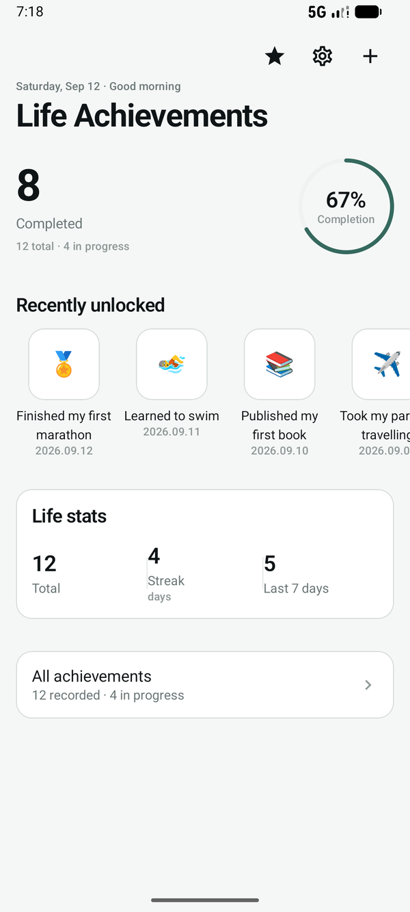
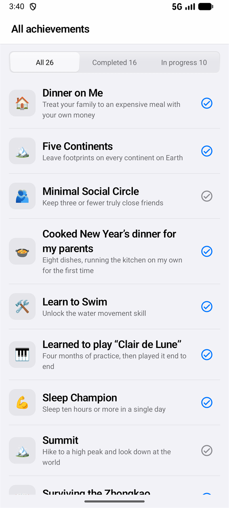
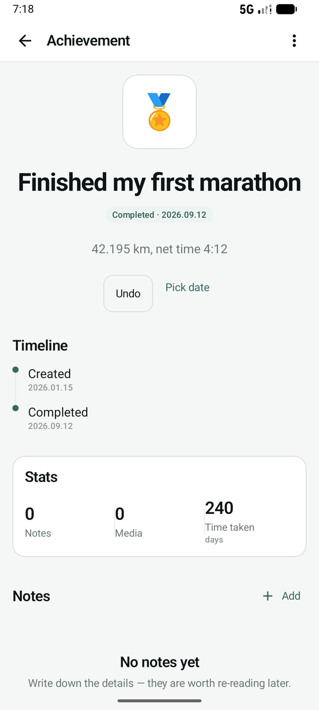
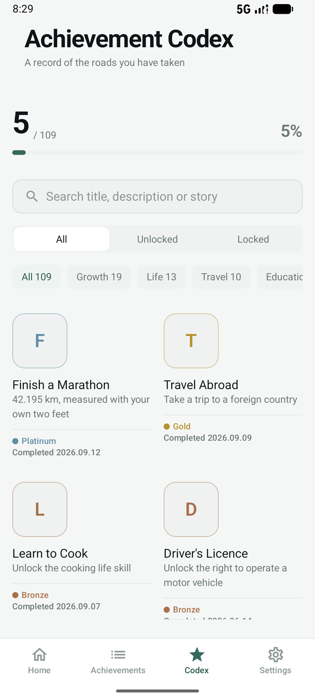
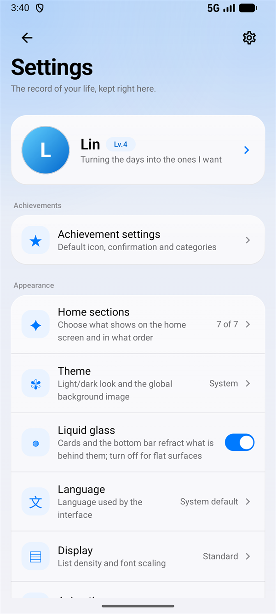
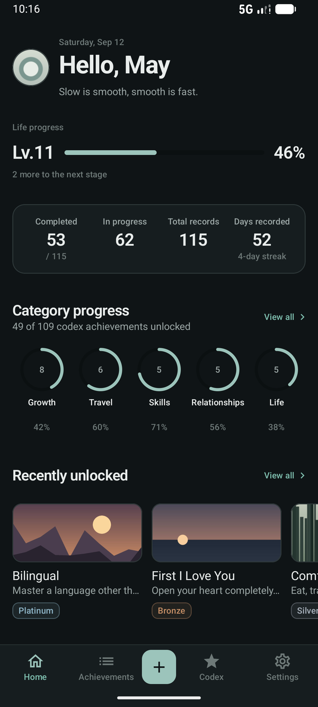

# LifeLedger

[简体中文](README.md) | **English**

> Treat your life like a game: record it, sort it out, look back on every step you have taken.

A **fully offline** Android app for recording personal achievements. No account, no server, no analytics — all your data stays on your own phone.


> **Rather not build it yourself?** Download the APK from [Releases](https://github.com/mrlingan/LifeLedger/releases/latest) and install it. Android 7.0 and above.

> Current version **v1.2.5** (versionCode 6) · [Changelog](#changelog)

Built and maintained by **[mrlingan](https://github.com/mrlingan)**.

---

## What is this

Most "tracking" apps end up as to-do lists: add an item, tick it off, forget it.

This project tries something a little different — it treats **what has already happened** as something to collect, instead of stacking up **what has not happened yet** in front of you. So:

- the home screen is a life dashboard: the first thing you see is **how much you have already completed**, not how much is left
- every achievement keeps its own details, with photos and videos attached, so it becomes something you can look back on
- a built-in codex of 109 achievements to collect and unlock
- completion dates can be set by hand — because *when* something happened should be your call

---

## Features

### 🚀 First launch

- It asks one question — where to start: **default** adds all 109 preset achievements to your achievement list, ready to be completed one by one; **from scratch** keeps the list empty so you only record what you write yourself
- Neither choice affects the codex — all 109 stay browsable, pickable and unlockable
- Anyone upgrading from an earlier version is not asked again

### 📊 Home · life dashboard

- Greeting, date and a one-line encouragement (your own nickname and signature once you set them), with "add achievement" on the right
- Once you set a nickname or a photo, your avatar appears in the top-left corner and taps through to your profile
- **Life progress**: a stage (one stage per 5 completed achievements) with the bar and the percentage side by side, and how many are left to the next stage
- **Core data**: completed / in progress / total records / days recorded — four figures in one row, label above number, nothing else
- **Category progress**: how much of each codex category you have collected, five small rings plus a "View all" link into the codex
- **Recently unlocked**: cards for the latest 3, with a cover (your own photo if there is one, otherwise the first character of the title), title, description and rarity — exact dates are not shown here, only inside the detail screen
- One closing line — "Recording since X · N days"
- **Modular sections**: everything below the greeting can be switched off or dragged into a new order under Settings → Home sections (long-press any row to start editing). Three are on by default — **life progress / metrics / category progress** — because "recent unlocks" adds three cards, "recording since" is a single date, and "custom image" needs an image first; turn them on in settings whenever you want them. Hide them all and the home screen offers a shortcut straight back
- The home screen is overview only — **no achievement list on it**, so it never grows longer as you record more

### 🏆 Achievements · kept apart from the home screen

- **All achievements**: its own list screen with All / Completed / In progress filters (the filter stays pinned at the top), and a one-tap completion toggle on the right of every row
- New achievement: pick one from the codex to prefill it, or write your own (title, description, icon)
- Edit and delete (deleting also cleans up that achievement's notes and media)
- Mark complete / undo, with a **manually chosen completion date** (system date picker)
- Completing an achievement gives one short haptic tap and a soft chime (`res/raw/complete.wav`); undoing stays silent, and no extra permission is needed
- Detail screen: large icon hero, unlock timeline, related stats, notebook

### 📖 Achievement codex · a life archive

- 109 preset achievements across 14 categories: growth, life, travel, study, love, entertainment, social, hobbies, skills, career, family, newbie village, health, finance
- Five rarity tiers — bronze / silver / gold / platinum / legendary — derived from how rare each achievement is
- **An archive index**: the emblem on the left, the name on the first line beside it, the description under the name, then the rarity — one column on a phone, two on wider screens. Locked entries also show the achievement rate; completion dates show up only in the detail screen
- **Three ways to narrow it down**: keyword search, all / unlocked / locked, and category
- Unlocked entries use a rarity-tinted emblem and primary text; locked ones keep their name, description and rarity but sit a step lower in contrast — no padlocks, no question marks
- "Pick from the codex" prefills title, description and icon on the new-achievement screen
- **The codex shares one source of truth with the rest of the app**: undo a completion anywhere and the codex goes back to locked

### 📝 Notebook and media

- Several notes per achievement, each editable and deletable
- Notes can carry images, videos and **live photos**
- Live photos are parsed so the embedded video is stored separately — long-press the image to play it once
- Every media file is copied into the app's private folder, so nothing depends on the original in your gallery

### 💾 Backup

- One-tap export to a `.zip` containing all structured data, the original images and videos, and your profile (nickname, signature, avatar)
- You can **protect the whole backup with a passphrase** (PBKDF2-HMAC-SHA256 key derivation + AES-256-GCM): leave it empty for a plain zip, or set one and everything inside is ciphertext; importing an encrypted backup asks for the passphrase automatically
- Import with a second confirmation (restore overwrites everything)
- Media paths inside a backup are relative, so **restoring on a new phone works**

### ⚙️ Settings

- **Achievements**: the default icon for new achievements (a built-in emoji, or **your own uploaded image**), a confirmation step before completing, favourite categories (they sort first on the home screen and in the list)
- **Theme**: follow system / light / dark
- **Liquid glass**: one switch (on by default) for whether cards and the bottom bar refract what is behind them; the settings sub-pages, segmented controls, buttons and selected chips use the same material; turn it off for flat surfaces (a handy battery switch too)
- **Language**: follow system / 简体中文 / English
- **Home sections**: one list, and its order is the home screen's order. **Long-press any row to start editing** — a ⊖ / ⊕ appears on the left (hide / put back) and a ≡ drag handle on the right. Changes apply immediately, there is nothing to save
- **Category colours**: tucked under the "Core data" row — tap it to expand — give each codex category its own ring colour (the five rings in the home screen's category progress); anything you leave alone follows the theme accent. Display only
- **Categories of your own**: when creating or editing an achievement you can give it a category — or make a new one on the spot — and the home screen's category progress has switches for which five it shows (five at most)
- **Custom image**: put a picture of your own on the home screen, cropped by dragging and pinching as you upload; the card is 72dp tall, less than half of the life-progress card. **With no image it never shows, even if the switch is on**
- **Display**: list density (compact / standard / comfy) and font scale
- **Animation**: full / reduced / off
- **Backup and restore**: export, import, and how much data you have
- **Daily reminder**: pick a time and frequency (every day / weekdays); a local system alarm posts one notification — no WorkManager involved
- **App lock**: the app password and fingerprint / face are two independent locks — use either or both. **A lock you turned off never appears on the lock screen** (a capable device is not the same as an enabled setting); re-locks 30 seconds after you leave the app
- **Remove app password**: its own entry in settings, confirmed with the current password — not a button squeezed in next to "save"
- **Data security**: where your data lives, the **local encryption switch**, and a shortcut to backup
- **Profile**: nickname, avatar and a personal signature; the nickname shows up in the home greeting and the signature right under it. There are eight built-in avatars (sunrise, wave, mountain, leaf, moon, cloud, sparkle, petal — drawn in code, nothing added to the APK), or upload your own photo, which is copied into app-private storage so it does not depend on your gallery. **An avatar can be swapped but not removed**: with no built-in avatar picked and no photo uploaded, the avatar is the first character of your nickname
- **About**: version number and open-source licences

### 🎨 Interface

- A complete custom design system (colour / type / spacing / radius / motion)
- **No default-looking Material components**: cards, buttons, text fields, dialogs, switches and filters are all hand-built
- **Bottom navigation**: home / achievements / codex / settings plus a centre "record achievement" action. The bar itself is a slab of **liquid glass** — a single-pass AGSL shader refracts the page behind it along a rounded-rect SDF, with edge dispersion and a rim highlight, so content slides under the glass. The selection indicator is a **glass droplet** that slides, stretches and settles, and can be dragged and snapped onto the nearest tab. Hidden automatically on secondary screens (detail, new achievement, backup)
- **The home and settings sections are liquid glass too**: the life progress / metrics / category progress / recent-unlock cards, the settings groups, and every settings sub-page (achievements, home sections, backup, reminder, data security) go through the same refraction pipeline, sampling the background layer (wallpaper + veil) so their edges bend the picture the way the bar does; with no wallpaper set there is nothing to bend, and the cards stay a milky slab with a sheen and a rim
- **Buttons, segmented controls, selected chips and the numeric keypad on the lock screen and in dialogs share that material**: the accent buttons are tinted glass with an accent label rather than a solid blue slab, and where there is nothing to sample (dialogs live in their own window, the lock screen is opaque by design) it falls back to a frosted slab with the sheen and the rim
- **Segmented controls move like the bottom bar**: the selected glass pill slides from the old option to the new one, stretching as it goes and settling back, and you can press and drag it straight onto the option you want; the labels sit above the pill so they stay crisp the whole way, and there is no ripple — the pill itself is the feedback
- **The app password is typed on an in-app numeric keypad**: nothing about it depends on the system IME (no candidate bar, no suggestions, no keyboard height to fight), and setting or changing it is three steps — current password → new password → type it again — one question at a time
- Dark mode has its own palette, not an inverted one
- **Chinese and English**: follow the system language; all 109 codex titles, descriptions and stories are fully translated

---

## Screenshots

| Home | All achievements | Achievement detail |
|:---:|:---:|:---:|
|  |  |  |
| Achievement codex | Settings | Dark mode |
|  |  |  |

> Screenshots are taken from a real device. Chinese screenshots are in [README.md](README.md).

The data in those screenshots was not tapped in by hand: **Settings → Developer options →
Generate demo data** writes 26 achievements (22 from the codex, 4 written by hand),
7 notes, 4 program-drawn photos and a profile, and turns every home section back on.
It uses a fixed random seed, so generating twice gives the same structure — screenshots
you retake later will not gain or lose a row. Change `DemoDataSeeder.SEED` for a different
set. That group only opens up to debug builds: the package is either **signed with the
default Android debug certificate** or is itself **debuggable**. When neither holds — a
real release install — the group is not rendered at all, so there is nothing to hit by
accident. Building a screenshot package with your release keystore? Flip
`DemoAccess.FORCE_SHOW` to `true`. "Clear achievement data" next to it resets the slate
for the next round.

---

## Tech stack

| Area | Choice |
|---|---|
| Language | Kotlin 2.2.10 |
| UI | Jetpack Compose (Material 3 only as a host for a few components) |
| Architecture | MVVM + Repository |
| Local storage | Room 2.7.2 (database version 4, with 1→2→3→4 migrations) |
| Navigation | Navigation Compose 2.8.9 |
| Async | Coroutines + Flow |
| Images | System photo picker (no storage permission needed) |
| Security | AndroidX Biometric 1.1.0 |
| Encryption | Android Keystore + AES-256-GCM; local data uses envelope encryption, backups can be passphrase-protected (PBKDF2-HMAC-SHA256) |
| Build | AGP 9.3.0 · Gradle 9.5 · JDK 17 |
| Minimum | Android 7.0 (API 24) |

**No networking library is included** — this project is offline by design.

---

## Design system

The design system was built before any screen was written, and every screen takes its styling from it.

```
ui/theme/
├── Color.kt     semantic palette: neutral greys + a single teal accent + five rarity metals
├── Type.kt      10 type styles, numbers on their own scale with tabular figures (tnum)
├── Dimens.kt    spacing 4/8/12/16/24/32/48/64, radii 8/12/16/20
├── Shape.kt     shapes derived from the radius tokens
├── Motion.kt    motion at 150/200/250/300ms with three easing curves
└── Theme.kt     maps Material roles onto the semantic palette
```

A few rules that are deliberately followed:

- **no hard-coded colours** in screens (they all live in one file)
- **no dp values outside the system**
- hierarchy comes from surface contrast + 1dp outlines, **never shadows**
- motion is limited to 8dp shifts and fades, no bounce

Public components live in `ui/components/`: `AppTopBar`, `AppBottomBar`, `AppCard`, `AppButton`, `AppIconButton`, `AppTextLink`, `AppTextField`, `AppDialog`, `AppSnackbar`, `AppChip`, `AppSwitch`, `AppSettingRow`, `SegmentedControl`, `AchievementCard`, `RarityBadge`, `StatusBadge`, `MetricNumber` / `StatTile`, `ProgressBar` / `ProgressRing` / `IndeterminateBar`, `SectionHeader` / `TimelineItem`, `EmptyState`, `AppearAnimation`.

Liquid glass lives in `ui/components/liquidglass/`: `LiquidGlassBackdrop` (the sample source — two of them, actually: the theme records a "background" layer for the in-page glass cards, the nav host records "background + page" for the bar; glass must never be recorded into the layer it samples, so the two have to stay apart), `GlassSurface` (refraction / dispersion / rim highlight — shader on API 33+, blur on 31–32, flat frost below), `LiquidGlassTabBar` (the bar and its droplet) and `GlassStyles` (the small reusable slabs behind buttons and selected chips / rows). In a screen, `AppCard(tone = AppCardTone.Glass)` is a glass card.

Two composition locals split the question in two: **do we want glass** is `LocalLiquidGlassEnabled`, **is there anything to refract** is whether `LocalLiquidGlassBackdrop` is null. Dialogs and the lock screen cannot sample what is behind them, so they null the sampling source — the glass is still there, there is simply nothing to bend. Note also that a `RenderEffect` bakes the `RuntimeShader` uniforms it had at creation time, so any uniform change (switching light / dark being the obvious one) has to rebuild the effect; otherwise the glass keeps the colours it was first created with and looks like it needs a restart. Shader source: `res/raw/liquidglass_effect.agsl`.

---

## Getting started

### Install directly

Download the APK from [Releases](https://github.com/mrlingan/LifeLedger/releases/latest), allow installing apps from unknown sources in your phone's settings, and install it. No account, and no network permission. The only permission it may ever ask for is notification access for the daily reminder, and only when you turn that reminder on.

Every release ships two packages:

| Package | What it is |
| --- | --- |
| `LifeLedger-v1.2.5.apk` | The signed release build — the one to install |
| `LifeLedger-v1.2.5-debug.apk` | Debug build, with an extra "Settings → Developer options" group (generate demo data / clear achievement data) for reproducing the UI and retaking screenshots |

> Both are signed with APK Signature Scheme v2, which covers `minSdk 24` (Android 7.0) and above. The SHA-256 for verification is in each release's notes.

### Build from source

Requirements:

- Android Studio (latest stable recommended)
- JDK 17
- Android SDK Platform 35

```bash
git clone https://github.com/mrlingan/LifeLedger.git
cd LifeLedger
```

Open the project root in Android Studio → wait for Gradle sync → Run.

> **Note for users in mainland China**: the project already configures an Aliyun mirror in `settings.gradle.kts`, with the official repositories as a fallback. If sync is still slow, add `C:\Users\<you>\.gradle` and the project folder to your Windows Defender exclusions — real-time scanning is the main reason builds like this are slow.

### Before you publish your own build

- the app name in `app/src/main/res/values/strings.xml`
- the launcher icon (`res/mipmap-*`)
- if you maintain a fork, change `applicationId` (`com.Anchored.mylife`) in `app/build.gradle.kts` — **the system will treat it as a brand-new app, so old data will not migrate**; export a backup and import it instead

---

## Project structure

```
app/src/main/
├── java/com/Anchored/mylife/
│   ├── MainActivity.kt
│   ├── data/
│   │   ├── backup/        backup and restore (zip packing / unpacking / optional passphrase)
│   │   ├── crypto/        local field encryption (envelope encryption + row-by-row migration)
│   │   ├── dao/           Room DAOs
│   │   ├── database/      entities, database, migrations, database provider
│   │   ├── media/         media file copying, live photo parsing
│   │   ├── preset/        preset achievement seeder
│   │   ├── profile/       private copy of the avatar + built-in avatar ids
│   │   ├── reminder/      daily reminder (system alarm + notification + boot reschedule)
│   │   ├── repository/    repository layer and single entry point
│   │   └── settings/      app settings (SharedPreferences)
│   └── ui/
│       ├── components/    shared UI components (liquidglass/ = liquid glass; built-in avatars are drawn in PresetAvatar.kt)
│       ├── home/          home sections (greeting, life progress, metrics, categories, recent)
│       ├── codex/         codex entry and progress sections
│       ├── demo/          demo data generator + the gate that decides who sees it
│       ├── theme/         design system
│       ├── AchievementNavHost.kt    navigation, theme, app lock
│       ├── HomeScreen.kt / HomeViewModel.kt        home overview (no list)
│       ├── OnboardingScreen.kt      first launch: where to start
│       ├── AllAchievementsScreen.kt / AchievementListViewModel.kt   achievement list
│       ├── AchievementRow.kt        list row (the only implementation of that look)
│       ├── AddOptionsSheet.kt       "pick from the codex / write my own" sheet
│       ├── AchievementDetailScreen.kt / ViewModel
│       ├── AddAchievementScreen.kt
│       ├── PresetAchievementScreen.kt / ViewModel
│       ├── ProfileScreen.kt / ProfileViewModel.kt        profile
│       ├── AchievementSettingsScreen.kt / ViewModel      achievement settings
│       ├── HomeLayoutScreen.kt / HomeLayoutViewModel.kt  home section toggles and ordering
│       ├── ReminderScreen.kt / ReminderViewModel.kt      daily reminder
│       ├── DataSecurityScreen.kt / DataSecurityViewModel.kt   data security
│       ├── SettingsScreen.kt / ViewModel
│       ├── BackupScreen.kt / ViewModel
│       ├── MediaComponents.kt
│       ├── CompletionFeedback.kt    chime and haptics when you complete one
│       ├── AppLockGate.kt
│       └── PresetText.kt / PresetStringRes.kt   codex text localisation
├── assets/
│   └── preset_achievements.json   109 preset achievements (Chinese source, used as stable ids)
└── res/
    ├── values/           English (default)
    └── values-zh/        Chinese

scripts/preset_i18n/      codex text generator (re-run after editing achievement content)
docs/screenshots/         UI screenshots for the README (zh/ and en/ sets)
```

---

## Data and privacy

**Completely offline.** The app does not request the network permission and contains no networking code.

| Data | Where it lives |
|---|---|
| Achievements, notes, media records, codex progress | Room database (app-private storage) |
| Achievement titles / descriptions and note text | Ciphertext on disk once you turn on local encryption; the key lives in the system keystore and never travels with the database file |
| Images, videos, live photo copies | `files/media/` |
| Avatar copy | `files/profile/` |
| Theme, app lock and other preferences | SharedPreferences |

There are only two permissions, and both serve the daily reminder: `POST_NOTIFICATIONS` (asked for only when you turn the reminder on) and `RECEIVE_BOOT_COMPLETED` (reschedules the alarm after a reboot). No network permission.

Uninstalling the app deletes all of it, so **export a backup before switching phones**.

A backup file is a zip:

```
lifeledger_backup_20260912_1040.zip
├── backup.json         all structured data
├── media/              the original images and videos
└── profile/            copy of the avatar
```

You can optionally protect a backup with a passphrase (otherwise it is a plain zip). Importing clears the current data first and then writes the backup in — media files are stored again by file name in the current device's private folder, which is why cross-device restores line up correctly.

---

## Built-in achievement library

The 109 achievements in the codex come from the open-source project **[EarthOnline-Achievement](https://github.com/LKlingkong/EarthOnline-Achievement)** (declared MIT in that project's README), including each achievement's title, description, full story, category and completion rate.

The source data is kept as-is, with two adjustments:

- **Rarity**: the original data has four tiers (normal / rare / epic / legendary) with some labels contradicting their own completion rates. This project derives five tiers from the rate instead (bronze / silver / gold / platinum / legendary), without touching the source numbers.
- **Data structure**: the original keeps a one-line description and the full story separately; this project does the same, using them for the list and the detail sheet respectively.

### Multi-language

The codex text stored in the database is the original Chinese, and it is used only as a **stable identifier** (ids, backups and import/export all rely on it). What the UI shows is decided by `res/values/preset_strings.xml` (English, default) and `res/values-zh/preset_strings.xml` (Chinese). Switching the system language therefore takes effect immediately, with no database migration and no changes to data you have already recorded.

After editing achievement content, re-run the generator to produce those string resources:

```bash
pwsh -File scripts/preset_i18n/generate_preset_i18n.ps1
```

The script reads `source.tsv` (Chinese source) and `en.json` (English translation) from the same folder and writes the result to `out/`; copy that over `app/src/main/res/values*/preset_strings.xml` and `app/src/main/java/com/Anchored/mylife/ui/PresetStringRes.kt`. Any entry missing from the resources simply falls back to the Chinese source text — nothing crashes.

---

## Changelog

### v1.2.5 · versionCode 6

The database moves from v4 to v5, with a migration — **install straight over the old one and nothing you recorded is touched**. This round is about arranging your own home screen, adding your own categories, and using your own pictures.

**Home**

- **Sections you arrange yourself**: Settings → Home sections is one list, and its order is the home screen's order. Long-press any row to start editing: ⊖ / ⊕ on the left hides or restores a section, ≡ on the right drags it into place. Changes apply immediately, there is nothing to save
- **Core data**: the four cards now share one height — the label slot takes the tallest of the four, so an English label wrapping onto two lines no longer pushes its card up — and the supporting lines ("/ 110", "N-day streak") are gone. Four figures, nothing else
- **Custom image**: a new section, uploaded with drag-and-pinch cropping and 72dp tall. With no image it never shows, even with the switch on
- **Ring colours**: Settings → Home sections → Category colours, one colour per category; anything you leave alone follows the theme accent

**Categories**

- The achievement table gains a `category` column (v4 → v5 migration); entries brought in from the codex carry their category automatically
- Creating or editing an achievement lets you pick a category — or make a new one on the spot. The list is the union of codex categories, your own, and the ones your achievements use, and every screen that offers it offers the same one
- The home screen's category progress shows at most five, chosen with switches, and achievements you wrote yourself count too

**Icons and avatars**

- Achievement icons accept an image of your own now: emoji and images share the single column (an image is stored with a `file:` prefix), so there is no schema change and existing data is untouched. Backups carry the icon images with them
- Profile gains **8 built-in avatars** (sunrise / wave / mountain / leaf / moon / cloud / sparkle / petal — drawn in code, nothing added to the APK), and you can still upload your own photo. **An avatar can be swapped but not removed**: with neither, it is the first character of your nickname

**Liquid glass**

- Refraction spreads from the bottom bar to the home cards, the settings groups, every settings sub-page, buttons, segmented controls, selected chips, and the numeric keypad on the lock screen and in dialogs. Where there is nothing to sample it falls back to a frosted slab with a sheen and a rim, so the material never breaks
- A new **Liquid glass** switch turns it off for flat surfaces — which also saves a full-screen recording pass, handy on battery
- Fixed a real one: a `RenderEffect` bakes the shader uniforms it had at creation, so after switching light / dark the glass kept the colours it was born with and looked like it needed a restart
- Segmented controls share the bottom bar's motion: the glass pill slides from the old option to the new one, stretching on the way and settling at the end, and it can be pressed and dragged straight onto the option you want — the labels stay drawn above it the whole way

**App lock**

- The app password is typed on an **in-app numeric keypad**, with no system IME involved — no candidate bar, no suggestions, no keyboard height to fight, and no extra "open the keyboard / close the keyboard" step
- Setting or changing the password is three steps — current → new → type it again — one question at a time

**Other**

- Settings gains **Developer options → Generate demo data / Clear achievement data**: 26 achievements, 7 notes, 4 program-drawn photos and a profile, from a fixed random seed. The group only renders for a debug signature or a debuggable package; a real release install never sees it
- Backups now carry the built-in avatar id, custom icon images, the home image and the category preferences (your own categories, which five the home screen shows, the ring colours). Older backups still import
- Local encryption now covers the achievement category field as well
- Three new unit tests: `AchievementIconTest`, `AvatarPresetTest`, `CategoryCatalogTest`

### Earlier versions

- **v1.2-beta** (versionCode 5): liquid glass bottom bar (AGSL refraction and a draggable, snapping droplet) and the app lock (app password and biometrics as two independent locks)
- **v1.1.0** (versionCode 4): the home screen redrawn as a life dashboard, the codex turned into an archive with three-way filtering, profile, the remaining settings, local encryption and optional passphrase backups
- **v1.0.2** (versionCode 3): "All achievements" as its own page, the Google Play icon, a bilingual README
- **v1.0.1** (versionCode 2): manual language switch, a custom launcher icon
- **v1.0.0** (versionCode 1): first public release

---

## Roadmap

- [x] Create, edit, complete and delete achievements
- [x] Custom completion dates
- [x] Notes and media (images / videos / live photos)
- [x] 109-achievement codex with unlocking
- [x] Backup and restore
- [x] Design system and a full UI redraw
- [x] Dark mode and app lock
- [x] Local data encryption (manual switch, envelope encryption + row-by-row migration)
- [ ] Local encryption for media files (photos / videos)
- [ ] Icon system: `iconEmoji` → `iconKey`, unified vector icons (with a database migration and mapping for existing data)
- [x] Daily reminder (system alarm + notification, no WorkManager)
- [ ] Statistics screen: yearly recap, growth curve, timeline
- [x] Display and animation intensity settings
- [x] Freely customisable home sections (toggle and reorder, right in settings)
- [x] Profile (nickname, avatar, signature)

---

## Known limitations

- **Achievement icons are emoji today.** The data model stores emoji characters, which render differently depending on the manufacturer's system font; this will move to built-in vector icons (see the roadmap).
- Codex entries without an icon fall back to the first character of the title.
- The app lock relies on the device's fingerprint / face / PIN. If the device has no verification method set up, it cannot be enabled (deliberate, so you cannot lock yourself out).
- Field-level local encryption is a **manual switch** (Settings → Data security → Encrypt local data), off by default. When on, achievement titles/descriptions and note text are stored encrypted with a key kept in the system keystore, so it does not travel with the database file — enough to stop "copy the database file and read it elsewhere", not enough to stop someone with root who can run code on the same phone. Media files (photos, videos) are still not encrypted.
- There is no whole-database encryption (SQLCipher and the like); fields that are not sensitive by nature — codex content, media paths — stay in plain text.
- **Selective export does not exist yet.** The entry in Settings still says "coming soon"; export and import are whole-database operations today.

---

## Contributing

Issues and pull requests are welcome. Before submitting:

1. Run `./gradlew assembleDebug` and make sure it builds
2. When adding UI, reuse the components in `ui/components/` and don't put colours or sizes directly in screens
3. When changing the database schema, **always add a migration** and make sure old data can be upgraded

---

## License

[MIT License](LICENSE) © 2026 mrlingan

You are free to use, modify and distribute this project, including commercially, as long as you keep the copyright notice.

---

## Credits

- [EarthOnline-Achievement](https://github.com/LKlingkong/EarthOnline-Achievement) — the source of the 109 preset achievements
- [AndroidLiquidGlassView](https://github.com/QmDeve/AndroidLiquidGlassView) (Donny Yang, MIT) — the AGSL refraction / dispersion pipeline behind the bottom navigation
- [HeyBox-LiquidGlass](https://github.com/sjtt2/HeyBox-LiquidGlass) (MIT) — reference for wiring that pipeline up and for the droplet interaction
- [AndroidX](https://developer.android.com/jetpack) — Room / Compose / Navigation / Biometric
- [Material Symbols](https://fonts.google.com/icons) — functional UI icons

---

**Everyone is the protagonist of their own life.**
