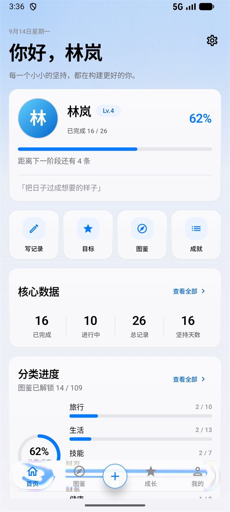
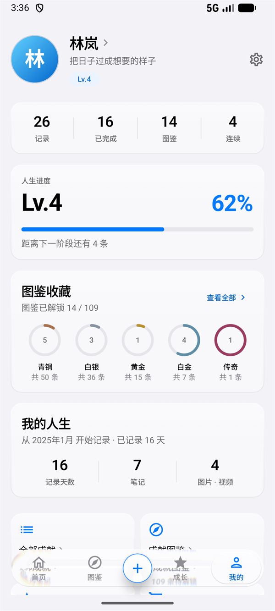
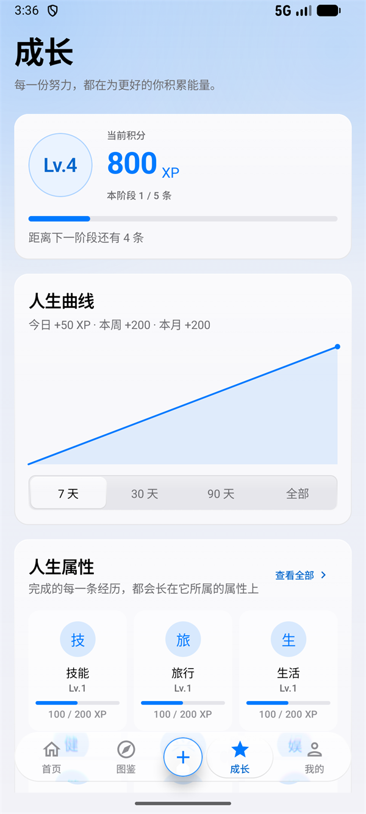
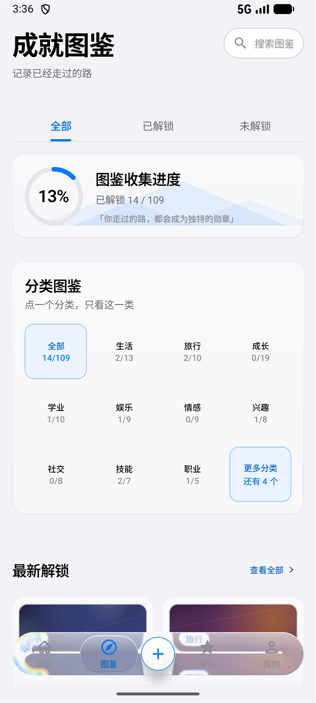
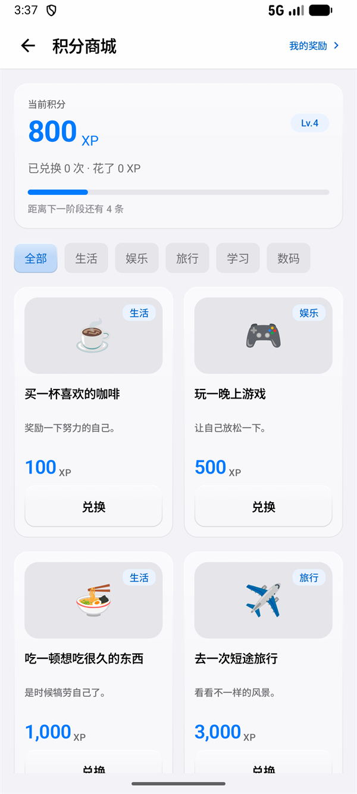
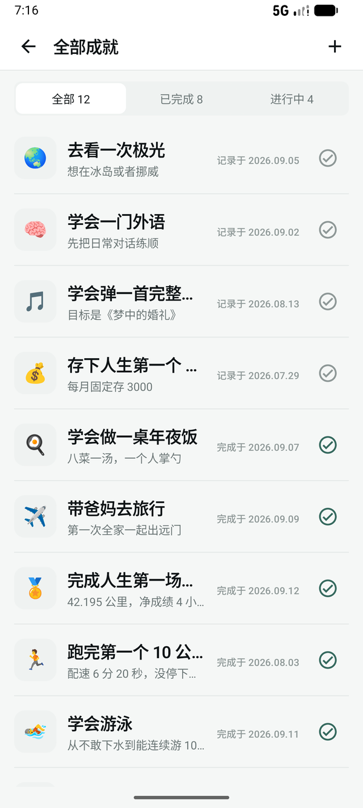
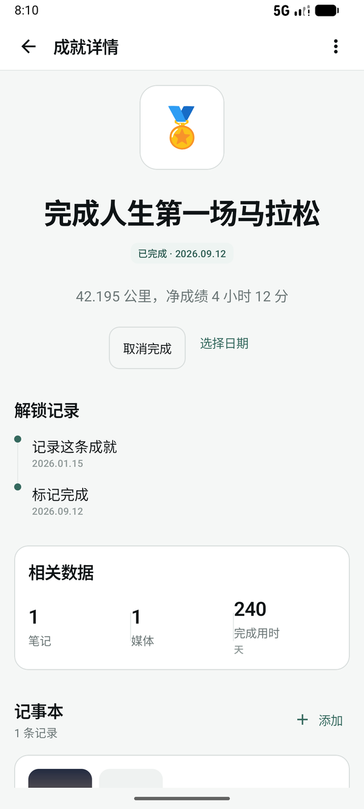
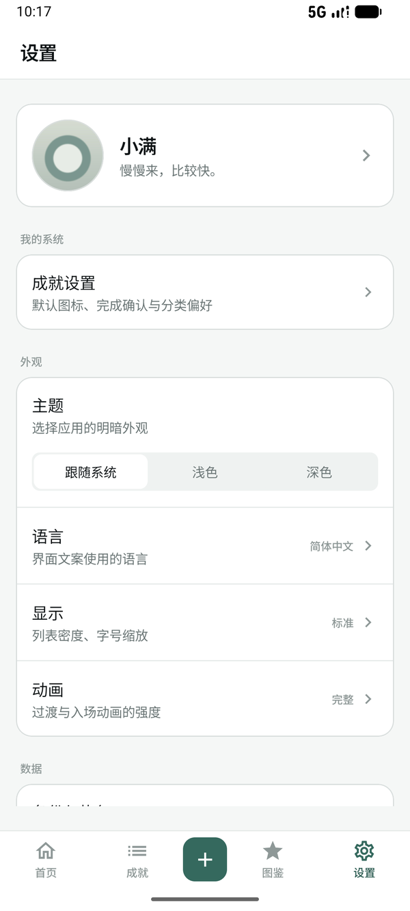
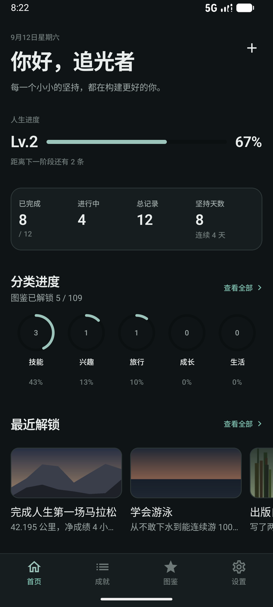

# LifeLedger · 人生账本

**简体中文** | [English](README.en.md)

> 把人生当成一款游戏，记录、整理、回顾你走过的每一步。

一个**完全离线**的 Android 个人成就记录应用。没有账号、没有服务器、没有埋点，所有数据只存在你自己的手机上。


> **不想自己编译？** 到 [Releases](https://github.com/mrlingan/LifeLedger/releases/latest) 直接下载 APK，装到手机上就能用。Android 7.0 及以上。

> 当前版本 **v1.5.9**（versionCode 9）· [更新日志](#更新日志)

由 **[mrlingan](https://github.com/mrlingan)** 开发与维护。

---

## 这是什么

大部分「记录类」App 最后都会变成待办清单：加一条、划掉、忘记。

这个项目想做的事稍微不一样——它把**已经发生的事**当成成就来收藏，而不是把**还没做的事**当成压力列在屏幕上。所以：

- 首页是「人生仪表盘」，第一眼看到的是**你已经完成了多少**，而不是还剩多少没做
- 每一条成就都能写下当时的细节、附上照片和视频，成为一条可以回看的记录
- 内置一份 109 条的成就图鉴，可以像收集一样去解锁
- 完成时间可以手动指定——因为「什么时候完成的」本来就该由你说了算

---

## 功能

### 🚀 第一次打开

- 先问一句「从哪里开始」：**默认**把 109 条预设成就加进「我的成就」列表，之后一条条去达成；**自定义**则从空白开始，只记录自己写下的成就
- 两种选择都不影响图鉴——109 条随时可以浏览、挑选、解锁
- 已经在用的用户（升级上来的）不会被问第二次

### 📊 首页 · 人生仪表盘

- 日期 + 问候语（设了昵称就是「你好，XX」）+ 座右铭，右上角是设置；记录入口在底栏正中间
- 页面上缘有一层很淡的蓝色光晕（首页与成长页）—— 卡片和底栏都是玻璃，压在这层底色上才有"浮着"的感觉
- **人生进度**：一张个人卡片 —— 头像、昵称、阶段牌子（每完成 5 条向上一个阶段）、完成百分比、进度条与「距离下一阶段还有几条」；用户自己写的签名压在卡片底部
- **快捷入口**：写记录 / 目标 / 图鉴 / 成就四个方块，全是直达已经存在的页面或弹层
- **核心数据**：已完成 / 进行中 / 总记录 / 坚持天数，一张卡片里一行四个数字，中间用细线分开，数字在上、标签在下（只留数字，不放补充小字）
- **分类进度**：左边一个总完成度的圆环，右边每个分类一行（名字、已解锁 / 总数、以及这个分类自己颜色的进度条）+ 「查看全部」进图鉴
- **最近解锁**：最近 3 条排成一列，每行封面 + 名称 + 稀有度 + 完成日期，点一下进详情
- 收尾一张很矮的卡片，居中写「从 X 开始记录 · 已记录 N 天」
- **板块可定制**：除问候语外的几段都能在「设置 → 首页板块」里开关、拖拽排序（长按任意一行进入编辑模式）。默认显示**人生进度 / 快捷入口 / 核心数据 / 分类进度**四段——「最近解锁」一次多出三行、「记录起点」只是一句日期、「自定义图片」得先上传图。全关掉时首页给一个直达入口，随时能恢复默认；从旧版本升上来的用户，快捷入口会自动补进布局里（只补这一次）
- 首页只做总览，**不放成就列表**：记录再多，首页的长度也不会变

### 👤 我的 · 我的档案

- 页头是头像 + 昵称 + 个人签名 + 阶段小牌子：整块点一下进个人资料，右上角那颗齿轮进设置
- **一句话总览**：总记录 / 已完成 / 图鉴已解锁 / 连续记录，一行四个数字
- **人生进度**：阶段、完成百分比与进度条。这几个数和首页出自同一套算法（`ui/LifeStats.kt`），两个页面永远对得上
- **图鉴收藏**：五档稀有度各一个圆环，环里是已解锁数量，下面写明这一档一共多少条
- **我的人生**：记录天数 / 笔记 / 图片 · 视频，配一行「从 X 开始记录 · 已记录 N 天」
- **快捷入口**：全部成就 / 成就图鉴 / 我的成长 / 积分商城（两行两个）
- **设置入口**：个人资料 / 提醒设置 / 备份与恢复 / 全部设置

### 🏆 成就管理 · 独立于首页

- **全部成就**：独立的列表页，支持「全部 / 已完成 / 进行中」筛选（筛选器固定在顶部），列表项右侧可一键切换完成状态
- 新建成就：可以从图鉴挑一条预填，也可以完全自己写（标题、描述、图标）
- 编辑与删除（删除会级联清理它下面的笔记和媒体）
- 标记完成 / 取消完成，**完成日期可以手动指定**（系统日历选择器）
- 标记完成的那一刻有一次触感反馈和一声轻音（`res/raw/complete.wav`）；取消完成保持安静，也不需要额外权限
- 成就详情页：大图标 Hero 区、解锁时间线、相关数据、记事本

### 📖 成就图鉴 · 人生经历档案馆

- 内置 **109 条**预设成就，覆盖成长、生活、旅行、学业、情感、娱乐、社交、兴趣、技能、职业、家庭、新手村、健康、财务 14 个分类
- 五档稀有度：青铜 / 白银 / 黄金 / 白金 / 传奇（按达成率自动推导）
- **一页看完收集情况**：页头收着一颗搜索药丸，往下依次是收集进度（圆环 + 已解锁多少条 + 一句口号）、分类图鉴（每格写明这一类收了多少，点一格只看这一类，放不下就折进「更多分类」）、最新解锁（最近完成的四条，带封面、分类标签与完成日期）、稀有度图鉴（五档各收了几个）
- **档案索引式陈列**：徽记在左，右侧第一行是名称、第二行是介绍，再下面是稀有度；手机一列，宽屏自动变两列。未解锁的额外标出达成率，完成时间只在详情里显示
- **三处收窄**：关键词搜索（点药丸展开，展开前不占一行）、全部 / 已解锁 / 未解锁的下划线标签、按分类；只要筛了其中任何一处，两段总览就退场，页面上只剩结果
- 已解锁用稀有度色描边的徽记和主文字色；未解锁保留名称、描述和达成率，整体降一档对比度——不做大锁，也不做问号
- 支持「从图鉴挑选」→ 自动预填标题、描述、图标到新建页
- **图鉴的达成状态与首页共用同一份数据**：在首页取消完成，图鉴会同步变回未解锁

### 💰 成长与积分商城

- **成长**：一张阶段卡（Lv. 与「本阶段 N / 5 条」，下面压着当前积分与进度条，和首页、我的、商城同一个数），人生曲线（7 天 / 30 天 / 90 天 / 全部，按天累计的积分变化）与今日 / 本周 / 本月的增量，**人生属性**（已完成的经历按分类长成一格一格的属性：等级、进度、这一级攒了多少），**成长记录**（账本上最近几笔，攒的与花的都在，成就的标题跟当前语言走），长期目标与每日任务（完成任务得积分，目标下的任务全做完自动收尾），每日一言（可选联网，默认关闭，每天只取一条），以及积分商城入口
- **积分商城**：奖励按分类排成两列，用积分兑换。内置六条起手式（一杯咖啡 100 XP → 升级电脑 10,000 XP），可以删掉，也可以自己加（名称 / 图标 / 分类 / 描述 / 价格）；分类是固定的生活 / 娱乐 / 旅行 / 学习 / 数码，自己起的分类会接在后面
- **账只有一本**：兑换是往积分流水里记一笔负数，余额永远由流水加出来——所以成长页的曲线、商城的余额、撤销之后的数字，三处永远对得上
- **「我的奖励」**：换过什么、花了多少都在这里，可以**撤销**——撤销记的是一笔正数退回来，不是把原来那笔涂掉；换错了不用去找客服

### 📝 记事本与媒体

- 每条成就下可以写多条笔记，支持编辑、删除
- 笔记可以附图片、视频、**实况照片**
- 实况照片会自动解析出内嵌的那段视频并单独保存，长按图片即可播放一次
- 所有媒体文件都会复制进应用私有目录，不依赖相册原图

### 💾 数据备份

- 一键导出为 `.zip`：包含全部结构化数据、原始图片视频，以及个人资料（昵称、签名、头像）
- 导出时**可以给整份备份设一个口令**（PBKDF2-HMAC-SHA256 派生密钥 + AES-256-GCM）：留空就是普通 zip，设了口令则连文件名之外的一切都是密文；导入时识别到加密会自动索要口令
- 导入恢复，带二次确认（覆盖式恢复）
- 备份文件里的媒体路径是相对路径，**换机之后也能正确还原**

### ⚙️ 设置

- **这一页本身**：大标题 + 一句话的页头（和首页、成长页同一套），下面依次是资料卡（头像 / 昵称 / 阶段 / 签名，点一下进个人资料）与按用途分组的卡片；每一行行首是一枚软色方块里的单线符号（★ ✦ ✾ ◍ ♢ 这些几何 / 箭头 / 带圈字形，不是彩色 emoji），右上角的齿轮打开**快速设置**——明暗模式与液态玻璃两项，改完立刻生效
- **成就设置**：新成就的默认图标（内置 emoji，或者**上传自己的图片**）、标记完成前的二次确认、关注的分类（关注的分类在首页和列表里排前面）
- **主题**：跟随系统 / 浅色 / 深色
- **全局背景图**：从相册挑一张铺在所有页面底层，可以调显示强度；图片会复制一份进应用私有目录（`files/background/`），相册原图删掉也不影响
- **液态玻璃**：一个开关（默认开启），控制卡片与底栏要不要折射背后的画面；设置子页的分组卡片、分段控件、按钮、选中的标签也都是同一种材质；关掉后退回普通表面，也可以当省电开关用
- **语言**：跟随系统 / 简体中文 / English
- **首页板块**：一列到底，顺序就是首页的顺序；**长按任意一行进入编辑模式**——左边出现 ⊖ / ⊕（收起 / 放回），右边是 ≡ 拖拽柄，按住上下拖就能调整先后。改完即时生效，不用保存
- **分类可以自己加**：新建成就 / 编辑成就时能给成就挑分类，也可以当场新建一个自己的分类；首页「分类进度」最多列五个，关注的分类排在前面
- **自定义图片**：首页可以放一张自己的图，上传时拖动 / 双指缩放裁剪，卡片只有 72dp 高（不到人生进度那张卡的一半）。**没上传图就不显示，开关开着也一样**
- **显示**：列表密度（紧凑 / 标准 / 宽松）、字号缩放
- **动画**：完整 / 精简 / 关闭
- **备份与恢复**：导出、导入，以及当前数据量
- **每日提醒**：设定时间与频率（每天 / 工作日），到点用系统闹钟在本机弹一条通知；不引入 WorkManager
- **应用锁**：应用密码与指纹 / 面容两把锁，可以同时开也可以只开一把；**开关关掉的那把不会出现在解锁界面**（设备支持 ≠ 用户开启）；离开超过 30 秒自动重新锁定
- **应用密码用应用内的数字键盘输入**：不依赖系统输入法——候选栏、联想词、输入法键盘的高度都进不来；设置与修改是「当前密码 → 新密码 → 再输一次」三步，一步只问一件事
- **移除应用密码**：设置里单独一项，要输当前密码确认；不和「保存新密码」挤在同一个弹窗里
- **数据安全**：数据存放位置、**本地加密开关**、备份入口
- **个人资料**：昵称、头像、个人签名；昵称会出现在首页问候语里，签名出现在问候语下面。头像有八个内置的（日出 / 海浪 / 山峦 / 树叶 / 月夜 / 云朵 / 星芒 / 花瓣，画出来的，不占安装包），也可以上传自己的照片——上传的图会复制进应用私有目录，不依赖相册原图。**头像只能换不能拿掉**：没挑内置头像、也没上传照片时，头像就是昵称的第一个字
- **关于**：版本号与开源许可

### 🎨 界面

- 完整的自定义设计系统（颜色 / 字体 / 间距 / 圆角 / 动效）
- **没有使用任何 Material 默认观感的组件**：卡片、按钮、输入框、弹窗、开关、筛选器全部自己实现
- **底部导航**：首页 / 图鉴 / 成长 / 我的四个入口 + 正中间的「记录成就」；整条栏是一块**液态玻璃**——AGSL 单 pass 着色器按圆角矩形 SDF 折射背后的页面，带边缘色散与描边高光，内容从玻璃底下穿过；选中态是一颗**玻璃滴**，切换时滑动、拉长、落位回缩，也可以按住拖着走、松手吸附到最近的 tab；进详情、新建、备份这类二级页面时自动收起
- **首页与设置页的板块也是液态玻璃**：人生进度 / 快捷入口 / 核心数据 / 分类进度 / 最近解锁 / 收尾，设置页的小标题分组，以及设置里的每个子页（成就设置 / 首页板块 / 备份 / 提醒 / 数据安全），走同一条折射管线，折射的是背景图与遮罩那一层 —— 设了背景图时卡片边缘能看见画面被掰弯、带一点色散；没设背景图时折射看不出来，卡片仍是一块带高光与描边的奶玻璃
- **按钮、分段控件、选中的标签、锁屏与弹窗里的数字键盘，也是同一种玻璃**：有东西可以采样就折射，采不到（弹窗活在自己的窗口里、锁屏本身是不透明的）就退化成磨砂底 + 高光描边，材质不断档
- **分段控件和底栏是同一套动效**：选中那块玻璃滑块会从旧位置滑到新位置（滑动途中拉长、落位收回），也可以按住直接拖到想要的那一项，松手吸附；文字画在滑块之上，全程清晰；按下没有水波纹——反馈就是滑块本身
- 深色模式独立调色，不是简单的黑白反转
- **中英双语**：跟随系统语言切换，图鉴的 109 条标题 / 描述 / 故事都有完整英文版

---

## 截图

| 首页 | 我的 | 成长 |
|:---:|:---:|:---:|
|  |  |  |
| 成就图鉴 | 积分商城 | 全部成就 |
|  |  |  |
| 成就详情 | 设置 | 深色模式 |
|  |  |  |

> 截图取自应用实际运行的画面（1080×2400 缩放收录），英文界面截图见 [README.en.md](README.en.md)。

截图里的数据不是手点出来的：**设置 → 开发者选项 → 生成演示数据**会写进 26 条成就
（22 条来自图鉴、4 条自己写的）、7 条笔记、4 张程序画的配图和一份个人资料，
并顺手把首页板块恢复成全显示。数据用固定随机种子，反复生成拿到的是同一批结构，
所以重拍一遍截图不会今天多一条明天少一条；想换一批就改 `DemoDataSeeder.SEED`。
这一组默认只对调试包开放：**签名是 Android 默认调试证书**，或者**包本身可调试**。
两条都不满足时（用户装的正式包就是这种），设置页里连这一组都不渲染，更谈不上误触；
用正式 keystore 出截图包时，把 `DemoAccess.FORCE_SHOW` 改成 `true` 即可。
旁边的「清空成就数据」用来拍下一轮。

---

## 技术栈

| 类别 | 选型 |
|---|---|
| 语言 | Kotlin 2.2.10 |
| UI | Jetpack Compose（Material 3 仅作为部分组件的宿主） |
| 架构 | MVVM + Repository |
| 本地存储 | Room 2.7.2（数据库版本 7，含 1→2→…→7 六次迁移） |
| 导航 | Navigation Compose 2.8.9 |
| 异步 | Coroutines + Flow |
| 图片 | 系统照片选择器（无需存储权限） |
| 安全 | AndroidX Biometric 1.1.0 |
| 加密 | Android Keystore + AES-256-GCM；本地数据用信封加密，备份可选口令加密（PBKDF2-HMAC-SHA256） |
| 构建 | AGP 9.3.0 · Gradle 9.5 · JDK 17 |
| 最低版本 | Android 7.0（API 24） |

**没有引入任何网络库**——这个项目从设计上就不联网。

---

## 设计系统

在写页面之前先建立了完整的设计系统，所有页面只通过它取样式。

```
ui/theme/
├── Color.kt     语义色板：中性灰阶 + 单一青绿强调色 + 五档稀有度金属色
├── Type.kt      10 档字体，数字单独成体系并使用等宽数字（tnum）
├── Dimens.kt    间距 4/8/12/16/24/32/48/64，圆角 8/12/16/20
├── Shape.kt     形状由圆角 token 推导
├── Motion.kt    动效 150/200/250/300ms + 三种缓动
└── Theme.kt     Material 角色到语义色的映射
```

几个刻意遵守的规则：

- 页面里**不允许出现硬编码颜色**（全部集中在一个文件里）
- 页面里**不允许出现体系外的 dp 值**
- 层级靠「表面色差 + 1dp 描边」建立，**不用阴影**
- 动效只有 8dp 位移动画和淡入淡出，没有弹跳

公共组件位于 `ui/components/`：`AppTopBar`、`AppBottomBar`、`AppCard`、`AppButton`、`AppIconButton`、`AppTextLink`、`AppTextField`、`AppDialog`、`AppSnackbar`、`AppChip`、`AppSwitch`、`AppSettingRow`、`SegmentedControl`、`AchievementCard`、`RarityBadge`、`StatusBadge`、`MetricNumber` / `StatTile`、`ProgressBar` / `ProgressRing` / `IndeterminateBar`、`SectionHeader` / `TimelineItem`、`EmptyState`、`AppearAnimation`。

液态玻璃在 `ui/components/liquidglass/`：`LiquidGlassBackdrop`（采样源，两层 —— 主题录「背景层」给页面内的玻璃卡片，导航宿主录「背景 + 页面」给底栏；玻璃不能录进自己采样的那一层，所以两层必须分开）、`GlassSurface`（折射 / 色散 / 描边高光，API 33+ 走着色器，31–32 退化到模糊，更低版本是纯色磨砂）、`LiquidGlassTabBar`（底栏与玻璃滴）、`GlassStyles`（复用的小块玻璃：按钮、选中的标签 / 行）。页面里写 `AppCard(tone = AppCardTone.Glass)` 就是一块玻璃卡片。

两个 CompositionLocal 把那件事拆成两问：**要不要玻璃**看 `LocalLiquidGlassEnabled`，**能不能折射**看 `LocalLiquidGlassBackdrop` 是不是 null。对话框与锁屏采不到背后的画面，就把采样源置空——玻璃还在，只是没有东西可掰弯。另外 `RenderEffect` 会把 RuntimeShader 当时的 uniform 固化在自己内部，所以 uniform 一变（最典型的是切浅色 / 深色）就必须重建一份，否则玻璃会一直用第一次创建时的颜色，看起来就像"深色模式要重启才生效"。着色器源码在 `res/raw/liquidglass_effect.agsl`。

---

## 快速开始

### 直接安装

到 [Releases](https://github.com/mrlingan/LifeLedger/releases/latest) 下载 APK，在手机设置里允许「安装未知来源的应用」，安装即可。不需要账号，也不申请网络权限；唯一可能用到的是「每日提醒」的通知权限，而且只在你打开提醒开关时才会申请。

每个版本提供两个包：

| 包 | 说明 |
| --- | --- |
| `LifeLedger-v1.5.9.apk` | 正式签名包，日常使用装这个 |
| `LifeLedger-v1.5.9-debug.apk` | 调试包，多一组「设置 → 开发者选项」（生成演示数据 / 清空成就数据），用来复现界面、重拍截图 |

> 两个包都用 APK Signature Scheme v2 签名，对应 `minSdk 24`（Android 7.0）及以上。校验用的 SHA-256 写在每个 Release 的说明里。

### 从源码运行

环境要求：

- Android Studio（建议最新稳定版）
- JDK 17
- Android SDK Platform 35

```bash
git clone https://github.com/mrlingan/LifeLedger.git
cd LifeLedger
```

用 Android Studio 打开项目根目录 → 等待 Gradle Sync 完成 → 点 Run。

> **国内网络提示**：项目已经在 `settings.gradle.kts` 里配置了阿里云镜像，官方源作为兜底。如果同步仍然很慢，可以把 `C:\Users\<you>\.gradle` 和项目目录加入 Windows Defender 的排除项——实时扫描是这类项目构建慢的主要元凶。

### 打包发布前记得改

- `app/src/main/res/values/strings.xml` 里的应用名
- 应用图标（`res/mipmap-*`）
- 如果你是 fork 之后自己维护，建议把 `app/build.gradle.kts` 里的 `applicationId`（`com.Anchored.mylife`）换成你自己的——**改了之后系统会把它当成一个新应用，旧数据不会自动迁移**，需要用备份导出再导入

---

## 项目结构

```
app/src/main/
├── java/com/Anchored/mylife/
│   ├── MainActivity.kt
│   ├── data/
│   │   ├── backup/        备份与恢复（zip 打包 / 解包 / 可选口令加密）
│   │   ├── crypto/        本地字段加密（信封加密 + 逐行迁移）
│   │   ├── dao/           Room DAO
│   │   ├── database/      实体、数据库、迁移、数据库提供者
│   │   ├── media/         媒体文件复制、实况照片解析
│   │   ├── preset/        预设成就导入器
│   │   ├── profile/       头像的私有副本 + 内置头像的标识
│   │   ├── reminder/      每日提醒（系统闹钟 + 通知 + 开机重排）
│   │   ├── reward/        内置奖励目录（首次进商城时落库）
│   │   ├── repository/    仓库层与统一入口
│   │   └── settings/      应用设置（SharedPreferences）
│   └── ui/
│       ├── components/    公共 UI 组件（liquidglass/ 为液态玻璃；内置头像的画法在 PresetAvatar.kt）
│       ├── home/          首页区块（问候、人生进度、快捷入口、核心数据、分类进度、最近解锁、收尾）
│       ├── codex/         图鉴页头、收集进度、分类格子、最新解锁、稀有度与条目卡片
│       ├── demo/          演示数据生成 + 开发者选项可见性判定（只对调试签名 / 可调试包开放）
│       ├── reward/        积分商城（奖励卡片、我的奖励弹层、自定义奖励编辑）
│       ├── theme/         设计系统
│       ├── AchievementNavHost.kt    导航、主题、应用锁
│       ├── HomeScreen.kt / HomeViewModel.kt        首页总览（不放列表）
│       ├── MyScreen.kt / MyViewModel.kt            我的（页头 / 总览 / 图鉴收藏 / 数据量 / 快捷入口）
│       ├── LifeStats.kt            首页与「我的」共用的统计口径（阶段、坚持天数、图鉴解锁）
│       ├── OnboardingScreen.kt      首次启动：选择从哪里开始
│       ├── AllAchievementsScreen.kt / AchievementListViewModel.kt   全部成就列表
│       ├── AchievementRow.kt        成就列表项（列表观感只有这一处实现）
│       ├── AddOptionsSheet.kt       「从图鉴挑选 / 自己写」二选一弹层
│       ├── AchievementDetailScreen.kt / ViewModel
│       ├── AddAchievementScreen.kt
│       ├── PresetAchievementScreen.kt / ViewModel
│       ├── ProfileScreen.kt / ProfileViewModel.kt        个人资料
│       ├── AchievementSettingsScreen.kt / ViewModel      成就设置
│       ├── GrowthScreen.kt          成长（积分曲线、长期目标、每日一言）与商城入口
│       ├── HomeLayoutScreen.kt / HomeLayoutViewModel.kt  首页板块定制（长按进入编辑态：开关 + 拖拽排序）
│       ├── ReminderScreen.kt / ReminderViewModel.kt      每日提醒
│       ├── DataSecurityScreen.kt / DataSecurityViewModel.kt  数据安全
│       ├── SettingsScreen.kt / ViewModel
│       ├── BackupScreen.kt / ViewModel
│       ├── MediaComponents.kt
│       ├── CompletionFeedback.kt    标记完成时的音效与触感
│       ├── AppLockGate.kt
│       └── PresetText.kt / PresetStringRes.kt   图鉴文案本地化
├── assets/
│   └── preset_achievements.json   109 条预设成就（中文原文，作为稳定标识）
└── res/
    ├── values/           英文（默认语言）
    └── values-zh/        中文

scripts/preset_i18n/      图鉴文案生成脚本（改完成就内容后重新生成 string 资源）
docs/screenshots/         README 用的界面截图（zh/ 与 en/ 各一套）
```

---

## 数据与隐私

**完全离线。** 应用不申请网络权限，也不包含任何联网代码。

| 数据 | 存放位置 |
|---|---|
| 成就、笔记、媒体记录、图鉴进度 | Room 数据库（应用私有目录） |
| 成就标题 / 描述、笔记正文 | 打开「本地加密」后以密文落盘；密钥由系统 Keystore 保管，不跟数据库文件一起走 |
| 图片、视频、实况照片副本 | `files/media/` |
| 头像 / 自定义图标 / 首页配图 / 全局背景图的副本 | `files/profile/`、`files/icons/`、`files/home/`、`files/background/` |
| 主题、应用锁等偏好 | SharedPreferences |

权限只有两个，且都只服务于「每日提醒」：`POST_NOTIFICATIONS`（通知，仅在你打开提醒开关时申请）和 `RECEIVE_BOOT_COMPLETED`（重启后重排闹钟）。不申请网络权限。

卸载应用会连同数据一起删除，所以**换机前请先在设置里导出备份**。

备份文件是一个 zip：

```
lifeledger_backup_20260912_1040.zip
├── backup.json         全部结构化数据
├── media/              原始图片与视频
└── profile/            头像副本
```

导出时可以选择给整份备份设一个口令（不设就是普通 zip）。导入时会先清空当前数据再写入备份内容，媒体文件按文件名重新落地到当前设备的私有目录——所以跨设备恢复也能正确对上。

---

## 内置成就库

图鉴里的 109 条成就来自开源项目 **[EarthOnline-Achievement](https://github.com/LKlingkong/EarthOnline-Achievement)**（原项目 README 中声明为 MIT License），包含每条成就的标题、描述、故事全文、分类与达成率。

原始数据被完整保留，只有两处调整：

- **稀有度**：原数据只有四档（普通 / 稀有 / 史诗 / 传说），且存在标注与达成率相互矛盾的情况。本项目改为按达成率统一推导五档（青铜 / 白银 / 黄金 / 白金 / 传奇），不改动原始数据本身
- **数据结构**：原项目把「一句话描述」与「完整故事」分开存放，本项目沿用了这个结构，分别用于列表与详情页

### 多语言

图鉴正文在数据库里保存的是中文原文，它只作为**稳定标识**使用（id 对应、备份、导入导出都靠它）；界面上显示什么语言，由 `res/values/preset_strings.xml`（英文，默认）和 `res/values-zh/preset_strings.xml`（中文）决定。所以切换系统语言立刻生效，不需要迁移数据库，也不会动用户已有的数据。

改完成就内容之后，跑一次生成脚本重新产出这批 string 资源：

```bash
pwsh -File scripts/preset_i18n/generate_preset_i18n.ps1
```

脚本会读取同目录下的 `source.tsv`（中文原文）和 `en.json`（英文翻译），把结果输出到 `out/`，覆盖回 `app/src/main/res/values*/preset_strings.xml` 和 `app/src/main/java/com/Anchored/mylife/ui/PresetStringRes.kt` 即可。资源里缺哪条只会退回显示中文原文，不会崩。

---

## 更新日志

### v1.5.9 · versionCode 9

数据库从 v5 升到 v7（两次**纯新增**的迁移，**覆盖安装即可，已有数据一条都不会被动到**）。这一轮加了两个新页面（**我的**、**成长**与积分商城），重排了首页与图鉴，补上全局背景图，并修掉商城切语言后仍是中文的问题。

**首页**

- 版式重排：日期 + 问候语 + 座右铭，右上角换成设置入口，记录入口固定在底栏正中；页面上缘多一层很淡的蓝色背光，玻璃卡片压在上面才有"浮着"的感觉
- **人生进度**换成一张个人卡片：头像、昵称、阶段牌子、完成百分比、进度条与「距离下一阶段还有几条」，用户写的签名压在卡片底部
- 新增**快捷入口**：写记录 / 目标 / 图鉴 / 成就，四个方块都是直达已经存在的页面或弹层
- **核心数据**并成一张卡：已完成 / 进行中 / 总记录 / 坚持天数，数字在上、标签在下，中间用细线分开
- **分类进度**改成「左边一个总完成度的圆环 + 右边每个分类一行」（名字、已解锁 / 总数、以及这个分类自己颜色的进度条）
- **最近解锁**从卡片改成三行：封面 + 名称 + 稀有度 + 完成日期
- 收尾一张很矮的卡片，居中写「从 X 开始记录 · 已记录 N 天」
- 默认显示**人生进度 / 快捷入口 / 核心数据 / 分类进度**四段；从旧版本升上来的用户，快捷入口会自动补进布局里（只补这一次）

**我的（新页面）**

- 页头是头像 + 昵称 + 个人签名 + 阶段小牌子：整块点一下进个人资料，右上角那颗齿轮进设置
- 一句话总览：总记录 / 已完成 / 图鉴已解锁 / 连续记录，一行四个数字
- 人生进度：阶段、完成百分比与进度条 —— 这几个数和首页出自**同一套算法**（`ui/LifeStats.kt`），两个页面永远对得上
- 图鉴收藏：五档稀有度各一个圆环，环里是已解锁数量，下面写明这一档一共多少条
- 我的人生：记录天数 / 笔记 / 图片 · 视频，配一行「从 X 开始记录 · 已记录 N 天」
- 快捷入口：全部成就 / 成就图鉴 / 我的成长 / 积分商城；再往下是个人资料 / 提醒设置 / 备份与恢复 / 全部设置

**成长与积分商城（新页面）**

- **成长**：阶段卡（Lv. 与「本阶段 N / 5 条」，下面压着当前积分与进度条）、人生曲线（7 天 / 30 天 / 90 天 / 全部，按天累计的积分变化）、今日 / 本周 / 本月的增量、**人生属性**（已完成的经历按分类长成一格一格的属性：等级、进度、这一级攒了多少）、成长记录（账本上最近几笔，攒的与花的都在）、长期目标与每日任务（完成任务得积分，目标下的任务全做完自动收尾）、每日一言（可选联网，默认关闭，每天只取一条），以及积分商城入口
- **积分商城**：奖励按分类排成两列，用积分兑换。内置六条起手式（一杯咖啡 100 XP → 升级电脑 10,000 XP），可以删掉，也可以自己加（名称 / 图标 / 分类 / 描述 / 价格）；分类是固定的生活 / 娱乐 / 旅行 / 学习 / 数码，自己起的接在后面
- **「我的奖励」**：换过什么、花了多少都在这里，可以**撤销** —— 撤销记的是一笔正数退回来，不是把原来那笔涂掉
- **账只有一本**：兑换是往积分流水里记一笔负数，余额永远由流水加出来 —— 成长页的曲线、商城的余额、撤销之后的数字，三处永远对得上
- 修掉「切了语言，商城里还是中文」：内置那六条奖励的标题与描述是**落库**的，以前只在第一次进商城时按当时的语言写一次，之后就不再变。现在进商城（以及在这一页切语言）时会对一遍，只改内置的那几条；用户自己写的奖励、以及已经换过的兑换记录一律不动

**成就图鉴**

- **一页看完收集情况**：页头收着一颗搜索药丸，往下依次是收集进度（圆环 + 已解锁多少条 + 一句口号）、分类图鉴（每格写明这一类收了多少，点一格只看这一类，放不下就折进「更多分类」）、最新解锁（最近完成的四条，带封面、分类标签与完成日期）、稀有度图鉴（五档各收了几个）
- 条目仍是**档案索引式陈列**（徽记在左，名称、介绍、稀有度依次排下），未解锁的额外标出达成率
- **三处收窄**：关键词搜索（点药丸展开）、全部 / 已解锁 / 未解锁的下划线标签、按分类；只要筛了其中任何一处，两段总览就退场，页面上只剩结果

**设置**

- 这一页本身重做：大标题 + 一句话的页头（和首页、成长页同一套），下面是资料卡（头像 / 昵称 / 阶段 / 签名，点一下进个人资料）与按用途分组的卡片；行首改成软色方块里的单线符号（★ ✦ ✾ ◍ ♢ 这些几何 / 箭头字形，不是彩色 emoji），右上角的齿轮打开**快速设置**—— 明暗模式与液态玻璃两项，改完立刻生效
- 新增**全局背景图**：从相册挑一张铺在所有页面底层，可以调显示强度；图片会复制一份进应用私有目录（`files/background/`），相册原图删掉也不影响
- 移除「首页板块 → 分类颜色」这一项。随它一起下线的还有那一项里收着的「首页显示哪几个分类」开关与「新建分类」入口——它们本来就挂在这一项下面；新建分类仍然可以在新建 / 编辑成就时当场完成，首页「分类进度」没挑过时按「关注的优先 → 有进展的优先」自动排前五个
- 以前挑过的分类颜色仍然照常生效（偏好和备份里的那一份都还在），只是不再提供逐个挑色的入口

**权限与联网**

- 清单里多了 `INTERNET`，但默认关闭：只有打开「开发者选项 → 开启网络功能」之后，成长页才会去取每日一言；其余功能依旧完全离线

**其他**

- 新增四个单元测试：`LifeStageTest`、`GrowthAttributesTest`、`ProfileDetailsTest`、`RewardCatalogTest`

### v1.2.5 · versionCode 6

数据库从 v4 升到 v5（带迁移，**覆盖安装即可，已有数据不动**）。这一轮的重点是「首页自己排、分类自己加、图标和头像用自己的图」。

**首页**

- **板块可定制**：设置 → 首页板块，一列到底，顺序就是首页的顺序；长按任意一行进入编辑态，左边 ⊖ / ⊕ 收起或放回，右边 ≡ 拖拽排序，改完即时生效，不用保存
- **核心数据**：四张卡统一高度（标签槽取四个里最高的那个，英文标签在窄卡片里折行也不会把整张卡顶高），去掉「/ 110」「连续 N 天」这类补充小字，只留四个数字
- **自定义图片**：新增一个板块，上传时拖动 / 双指缩放裁剪，卡片 72dp 高；没上传图就不显示，开关开着也一样
- **分类圆环颜色**：设置 → 首页板块 → 分类颜色，逐个分类挑颜色；没挑过的跟随主题强调色

**分类**

- 成就表新增 `category` 字段（v4 → v5 迁移），从图鉴带过来的条目自动带上分类
- 新建 / 编辑成就时可以挑分类，也可以当场新建一个；可选清单 = 图鉴内置 + 你新建的 + 你在成就上用过的，三处页面看到的是同一份
- 首页「分类进度」最多显示五个，用开关挑；自己写的成就也能计入

**成就图标与头像**

- 成就图标可以上传自己的图片了：和 emoji 共用数据库里同一个字段（图片记成 `file:` 前缀），不用改表，老数据不受影响；备份会把图标图片一起打包
- 个人资料新增 **8 个内置头像**（日出 / 海浪 / 山峦 / 树叶 / 月夜 / 云朵 / 星芒 / 花瓣，代码画的，不占安装包），也可以继续上传自己的照片；**只换不删**，两样都没有时头像就是昵称的第一个字

**液态玻璃**

- 折射从底栏铺到首页卡片、设置页分组、所有设置子页、按钮、分段控件、选中的标签，以及锁屏与弹窗里的数字键盘；采不到背景时退化成磨砂底 + 高光描边，材质不断档
- 新增开关「液态玻璃」，关掉退回普通表面——顺带省掉一遍整屏录制，也能当省电开关用
- 修掉一个真问题：`RenderEffect` 会把着色器的 uniform 固化在创建那一刻，切浅色 / 深色之后玻璃一直用旧颜色，看起来像"要重启才生效"
- 分段控件与底栏共用同一套动效：滑块从旧位置滑到新位置（途中拉长、落位收回），按住可以直接拖到想要的那一项，文字全程画在滑块之上

**应用锁**

- 应用密码改用**应用内的数字键盘**输入，不依赖系统输入法——候选栏、联想词、输入法键盘高度都进不来，解锁与设置都不再多一步"弹键盘 / 收键盘"
- 设置 / 修改密码改成三步：当前密码 → 新密码 → 再输一次，一步只问一件事

**其他**

- 设置里新增**开发者选项 → 生成演示数据 / 清空成就数据**：写进 26 条成就、7 条笔记、4 张程序画的配图和一份个人资料，用固定随机种子；这一组只对调试签名或可调试的包渲染，正式包看不见
- 备份内容补齐：内置头像标识、自定义图标图片、首页图片、分类偏好（自建分类 / 首页显示哪五个 / 圆环颜色）；老备份照常能导入
- 本地加密覆盖到成就的分类字段
- 新增三个单元测试：`AchievementIconTest`、`AvatarPresetTest`、`CategoryCatalogTest`

### 更早的版本

- **v1.2-beta**（versionCode 5）：液态玻璃底栏（AGSL 折射 + 可拖拽吸附的玻璃滴）、应用锁（应用密码与指纹 / 面容两把锁各自独立）
- **v1.1.0**（versionCode 4）：首页重做成人生仪表盘、图鉴改成档案馆式陈列并加三重筛选、个人资料、设置项补齐、本地加密与可选口令备份
- **v1.0.2**（versionCode 3）：「全部成就」独立成页、Google Play 图标、README 补齐双语
- **v1.0.1**（versionCode 2）：手动语言切换、自定义启动图标
- **v1.0.0**（versionCode 1）：首个公开版本

---

## 路线图

- [x] 成就的增删改查与完成状态
- [x] 自定义完成日期
- [x] 笔记与媒体（图片 / 视频 / 实况照片）
- [x] 109 条成就图鉴与解锁
- [x] 数据备份与恢复
- [x] 设计系统与全站重绘
- [x] 深色模式与应用锁
- [x] 本地数据加密（手动开关，信封加密 + 逐行迁移）
- [ ] 媒体文件（图片 / 视频）的本地加密
- [ ] 图标体系：`iconEmoji` → `iconKey`，改用统一矢量图标（含数据库迁移与旧数据映射）
- [x] 每日提醒（系统闹钟 + 通知，不引入 WorkManager）
- [ ] 数据统计页：年度回顾、成长曲线、时间线
- [x] 显示与动画强度设置
- [x] 首页板块自由定制（长按进入编辑态：开关 + 拖拽排序）
- [x] 个人资料（昵称、头像、个人签名）
- [x] 「我的」页：页头（资料 + 阶段）、四个总览数字、人生进度、图鉴按稀有度收藏、数据量、快捷入口与设置入口

---

## 已知限制

- **成就图标目前是 Emoji**。数据模型里存的是 emoji 字符，不同厂商的系统字体渲染效果不同，长期会迁移到内置矢量图标（见路线图）。
- 图鉴里尚未配图标的条目，暂时以标题首字占位。
- 应用锁依赖系统的指纹 / 面容 / 锁屏密码；设备未设置任何验证方式时无法开启（这是刻意的，避免把用户关在外面）。
- 本地字段加密是**手动开关**（设置 → 数据安全 → 加密本地数据），默认关闭。开启后成就标题/描述与笔记正文加密存储，密钥由系统 Keystore 保管、不跟数据库文件一起走，能挡住"把库文件拷走"这类离线读取；挡不住已 root 且能在同机运行代码的人。媒体文件（图片、视频）目前仍未加密。
- 没有接入 SQLCipher 之类的整库加密，图鉴内容、媒体路径等本来就不敏感的字段仍以明文存储。
- **「导入 / 导出」里的选择性导出还没做**：设置里那一项仍标着「即将支持」，目前的导出和导入都是整库级别的。

---

## 贡献

欢迎 Issue 和 Pull Request。提交前建议：

1. 跑一次 `./gradlew assembleDebug` 确认构建通过
2. 新增 UI 时复用 `ui/components/` 里的组件，不要在页面里直接写颜色和尺寸
3. 修改数据库结构时**必须补迁移**，并且保证老数据可以正常升级

---

## 许可证

[MIT License](LICENSE) © 2026 mrlingan

你可以自由使用、修改、分发这个项目，包括商业用途，只需保留版权声明。

---

## 致谢

- [EarthOnline-Achievement](https://github.com/LKlingkong/EarthOnline-Achievement) —— 109 条预设成就的数据来源
- [AndroidLiquidGlassView](https://github.com/QmDeve/AndroidLiquidGlassView)（Donny Yang，MIT）—— 底部导航的 AGSL 液态玻璃折射 / 色散管线
- [HeyBox-LiquidGlass](https://github.com/sjtt2/HeyBox-LiquidGlass)（MIT）—— 上述管线的集成方式与玻璃滴交互参考
- [AndroidX](https://developer.android.com/jetpack) —— Room / Compose / Navigation / Biometric
- [Material Symbols](https://fonts.google.com/icons) —— 界面功能图标

---

**每个人都是自己人生的主角。**
